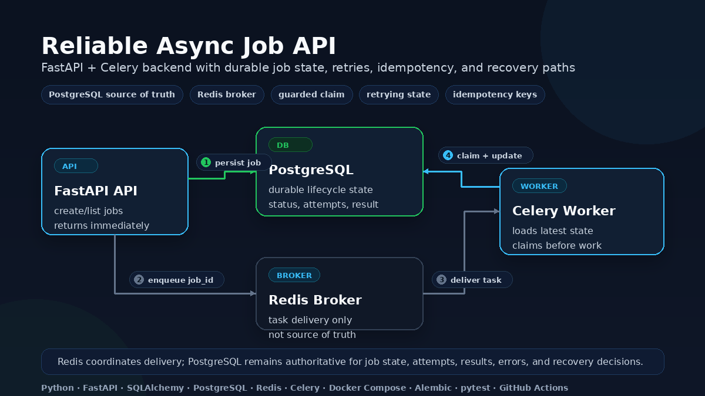
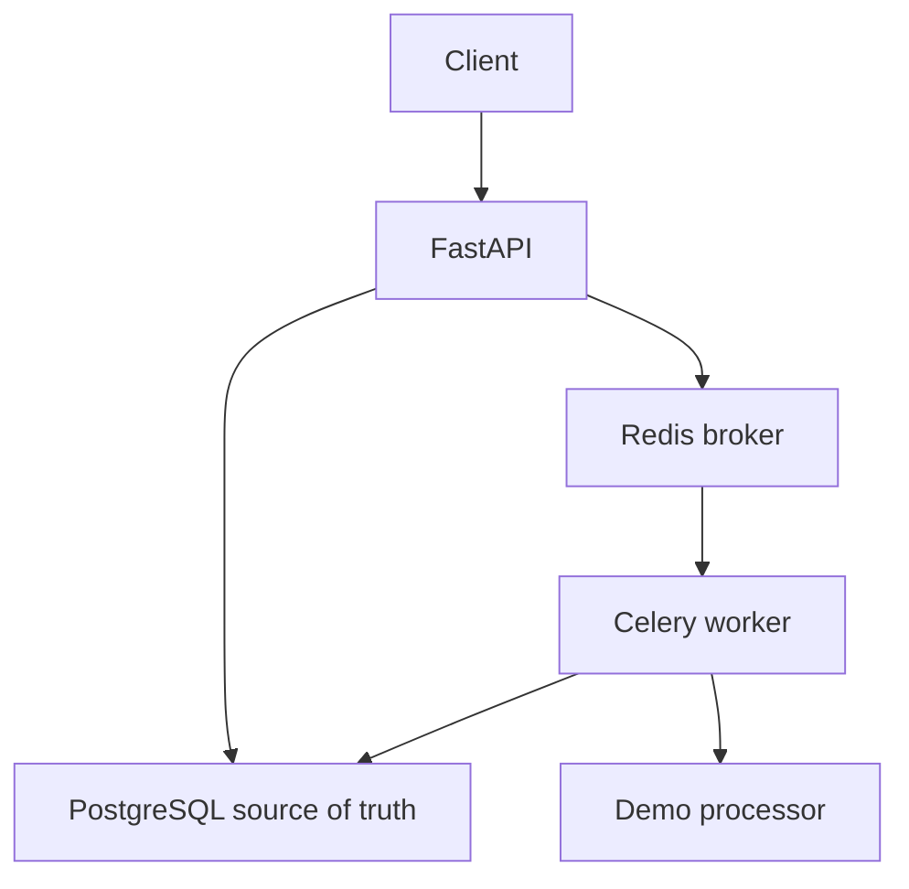
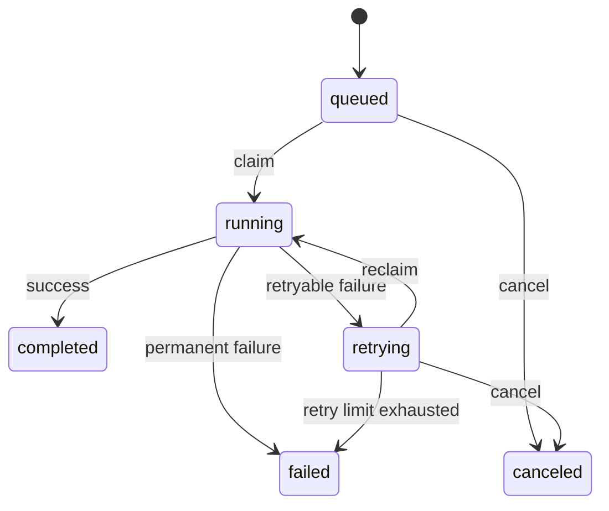

# Async Job API

[](https://github.com/melika-kheirieh/async-job-api/actions/workflows/ci.yml)

A compact FastAPI, SQLAlchemy, and Celery backend for durable asynchronous job
processing.

The API accepts work and returns immediately. Celery processes jobs in the
background, Redis coordinates task delivery, and PostgreSQL remains the source
of truth for every lifecycle transition.

> This project is production-aware, not production-complete. It handles selected
> retry, duplicate-delivery, and recovery risks without claiming exactly-once
> execution or exactly-once side effects.

## What This Demonstrates

- FastAPI API design around durable asynchronous work.
- PostgreSQL-backed job lifecycle state instead of in-memory task status.
- Celery and Redis integration with the database as the source of truth.
- Guarded state transitions for claim, cancellation, and recovery paths.
- Explicit retry state for jobs waiting on another Celery delivery.
- A separate processor boundary for demo payload handling.
- Idempotent job submission using a database uniqueness boundary.
- Focused tests for API, service, repository, processor, and worker behavior.
- Clear production boundaries for what the project does and does not guarantee.

## Final Demo

Run the full Docker-based demo:

```bash
./scripts/e2e_smoke.sh
```

The script starts a clean Compose stack, applies migrations, and verifies the
main public workflows end to end:

- canceling a waiting job before a worker can claim it;
- completing a successful job;
- persisting a non-retryable failure;
- exhausting retryable failures with Celery retry scheduling;
- returning the same job for a duplicate idempotency key;
- filtering `canceled`, `completed`, and `failed` jobs through the list API.

The cancellation scenario intentionally starts the API before the worker so the
job remains in `queued` long enough to cancel deterministically.

For a faster local check that does not require Docker services, run:

```bash
pytest -q
```

## Reliability Model

| Concern | Current approach |
|---|---|
| Durable job state | PostgreSQL stores status, payload, result, errors, attempts, and timestamps. |
| Task delivery | Redis brokers Celery delivery; API-visible state is read from PostgreSQL. |
| Concurrent delivery | A conditional database update allows only one successful claim. |
| Retry visibility | Retryable failures persist `retrying` before Celery schedules another attempt. |
| Cancellation | Waiting jobs can be canceled through a guarded transition. |
| Duplicate submission | A unique idempotency key returns the existing job. |
| Stuck execution | Manual recovery fails old `running` jobs conditionally. |
| Operational visibility | Stable lifecycle events include `job_id` and execution context. |
| Exactly-once behavior | Not guaranteed; side-effecting handlers must be idempotent. |

## Architecture





Application boundaries remain small and explicit:

```text
Router -> Service -> Repository -> Database
Celery task -> Worker orchestration -> Processor
Worker/API -> Service -> Repository -> Database
```

- The router owns HTTP concerns.
- The service owns job use cases.
- The repository owns persistence and guarded transitions.
- The worker owns orchestration: claim, process, mark final state, retry, and log.
- The processor owns demo payload behavior and retryable/non-retryable errors.
- The Celery task owns retry scheduling and delegates processing to testable logic.

Tasks carry only a `job_id`. The worker loads the latest payload and state from
PostgreSQL before attempting a guarded claim.

## Job Lifecycle



| Status | Meaning |
|---|---|
| `queued` | Waiting to be claimed. |
| `running` | Claimed and being processed. |
| `retrying` | Waiting for another attempt. |
| `canceled` | Canceled before a worker could claim or reclaim it. |
| `completed` | Finished successfully. |
| `failed` | Permanently failed or recovered as stuck. |

Only `queued` and `retrying` jobs are claimable. Those two states are also
cancelable. `completed`, `failed`, and `canceled` are terminal.

Claiming is performed with a conditional database update. Two workers may
receive the same task, but only one can transition the job from a claimable state
to `running`. The `attempts` counter increases only when that transition succeeds.

## Quick Start

Start PostgreSQL and Redis:

```bash
docker compose up -d postgres redis
```

Apply migrations:

```bash
docker compose run --rm api alembic upgrade head
```

Start the API and worker:

```bash
docker compose up --build api worker
```

The API is available at `http://localhost:8001` and its OpenAPI documentation at
`http://localhost:8001/docs`.

For manual API checks, set:

```bash
BASE_URL=http://localhost:8001
```

View worker logs:

```bash
docker compose logs -f worker
```

Stop the stack with `docker compose down`. Use `docker compose down -v` only when
you also want to delete local PostgreSQL data.

## API

| Method | Endpoint | Purpose |
|---|---|---|
| `POST` | `/jobs` | Create and enqueue a job. |
| `GET` | `/jobs/{job_id}` | Read durable state and result. |
| `GET` | `/jobs` | Filter and paginate jobs. |
| `POST` | `/jobs/{job_id}/cancel` | Cancel a waiting job. |

### Create a Job

```bash
curl -X POST "$BASE_URL/jobs" \
  -H "Content-Type: application/json" \
  -d '{"payload": {"text": "hello backend"}}'
```

The endpoint returns `201 Created` with a persisted job in `queued`. Submission
does not mean the background work has completed.

Add an optional idempotency key when clients may repeat a submission:

```bash
curl -X POST "$BASE_URL/jobs" \
  -H "Content-Type: application/json" \
  -d '{
    "payload": {"text": "same request"},
    "idempotency_key": "demo-123"
  }'
```

Repeating the same key returns the existing job without intentionally enqueueing
another task. The API treats the key as the request identity and does not compare
payloads for conflicting reuse. This deduplicates job creation, not execution or
side effects.

### Read and List Jobs

```bash
curl "$BASE_URL/jobs/1"
curl "$BASE_URL/jobs?status=failed&limit=20&offset=0"
```

List behavior:

- `status` is optional and accepts any lifecycle status;
- `limit` accepts 1-100;
- `offset` must be non-negative;
- results are ordered newest first;
- responses include `items`, `limit`, `offset`, and total matching `count`.

Unknown job IDs return `404`; invalid query parameters return `422`.

### Cancel a Job

```bash
curl -X POST "$BASE_URL/jobs/1/cancel"
```

Only jobs in `queued` or `retrying` can be canceled. Canceling a `running`,
`completed`, `failed`, or already `canceled` job returns `409 Conflict`. Missing
jobs return `404`.

Cancellation updates PostgreSQL state. It does not revoke a Celery task or
delete an already-published Redis message; a later stale delivery is skipped
because the worker cannot claim a canceled job.

## Failure and Retry Behavior

The demo processor exposes two deterministic failure inputs.

```bash
# Non-retryable: becomes failed immediately
curl -X POST "$BASE_URL/jobs" \
  -H "Content-Type: application/json" \
  -d '{"payload": {"text": "bad input", "fail": true}}'

# Retryable: enters retrying and eventually fails after the retry limit
curl -X POST "$BASE_URL/jobs" \
  -H "Content-Type: application/json" \
  -d '{"payload": {"text": "temporary issue", "transient_fail": true}}'
```

The retry policy allows three retries after the initial attempt. With the current
retry limit, scheduled countdowns are 1, 2, and 4 seconds; the backoff helper is
capped at 30 seconds. Before each retry, the latest error is persisted and the
next delivery must claim the job again.

## Stuck-Job Recovery

A worker can stop after claiming a job but before persisting its final state. The
service exposes:

```python
recover_stuck_jobs(timeout_minutes=10)
```

Recovery fails old `running` jobs instead of automatically requeueing work whose
previous outcome is uncertain. Its write succeeds only if the job is still
`running` and the observed `started_at` has not changed.

Recovery is manually invoked through the recovery CLI:

```bash
docker compose run --rm api python -m app.cli.recover_stuck_jobs --timeout-minutes 10
```

Scheduling, leases, heartbeats, fencing, and full stale-worker protection remain
out of scope. See the [operational runbook](docs/runbook.md) for local
diagnosis and recovery commands.

## Lifecycle Logging

Logs use stable events such as `job_created`, `job_claimed`, `job_retrying`,
`job_retry_scheduled`, `job_canceled`, `job_completed`, `job_failed`,
`job_skipped`, and `stuck_job_recovered`.

```text
event=job_claimed job_id=42 status=running attempts=2
event=job_completed job_id=42 status=completed attempts=2
```

This is lightweight lifecycle logging, not durable event history or a
centralized observability stack.

## Tests

Run the fast test suite:

```bash
pytest -q
```

It covers API, service, repository, worker lifecycle, retry, cancellation,
duplicate delivery, idempotency, listing, and recovery behavior without requiring
a live broker.

Run the multi-service smoke test:

```bash
./scripts/e2e_smoke.sh
```

The script starts a clean Docker Compose stack, applies migrations, and verifies
cancellation, successful completion, non-retryable failure, retry exhaustion,
duplicate idempotency behavior, and filtered job listing. It exits non-zero on
failure and cleans up on exit.

GitHub Actions runs `pytest -q` with Python 3.12 on pushes and pull requests. The
Docker smoke test remains a manual integration check.

## Decisions and Boundaries

- [Architecture decisions](docs/decisions.md)
- [Production boundaries](docs/production-boundaries.md)
- [Operational runbook](docs/runbook.md)

Important non-guarantees include:

- no exactly-once execution or side effects;
- no atomic database-to-broker publication;
- no broker-level cancellation or task revocation;
- no automatic scheduled recovery or dead-letter workflow;
- no full stale-worker fencing;
- no production observability or deployment hardening.

The project intentionally avoids expanding into Kafka, Kubernetes, multiple job
types, priority queues, an admin dashboard, distributed locking, or a complete
monitoring stack without a concrete operational need.